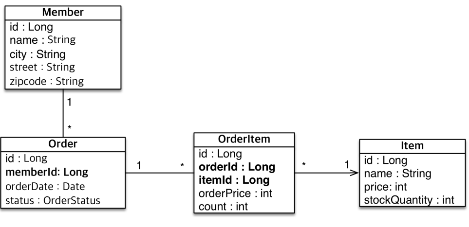

# 객체와 테이블 매핑

## @Entity

- @Entity가 붙은 클래스는 JPA가 관리, 엔티티라 한다.
- JPA를 사용해서 테이블과 매핑할 클래스는 @Entity 필수
- 주의
  - **기본 생성자 필수** (파라미터가 없는 public 또는 protected 생성자)
  - final 클래스, enum, interface, innter 클래스 사용x
  - 저장할 필드에 final 사용 x

## 데이터베이스 스키자 자동 생성

- DDL을 애플리케이션 실행 시점에 자동 생성
- 테이블 중심 -> 객체 중심
- 데이터베이스 방언을 활용해서 데이터베이스에 맞는 적절한 DDL 생성
- 이렇게 생성된 DDL은 개발 장비에서만 사용
- 생성된 DDL은 운영서버에서는 사용하지 않거나, 적절히 다듬은 후 사용

### hibernate.hbm22ddl.auto

| 옵션        | 설명                                         |
| ----------- | -------------------------------------------- |
| create      | 기존테이블 삭제 후 다시 생성 (DROP + CREATE) |
| create-drop | create와 같으나 종료시점에 테이블 DROP       |
| update      | 변경분만 반영(운영 DB에는 사용하면 안됨 )    |
| validate    | 엔티티와 테이블이 정상 매핑되었는지만 확인   |
| none        | 사용하지 않음                                |

---

## 엔티티 설계와 매핑

### 데이터 중심 설계의 문제점

- 현재 방식은 객체 설게를 테이블 설계에 맞춘 방식.
- 테이블의 외래키를 객체에 그대로 가져옴.
- 객체 그래프 탐색이 불가능
- 참조가 없으므로 UML도 잘못됨
