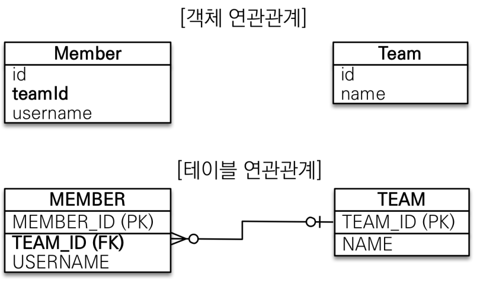

# 목표

- 객체와 테이블 연관관계의 차이를 이해
- 객체의 참조와 테이블의 외래 키를 매핑
- 용어 이해
  - 방향(Direction) : 단방향, 양방향
  - 다중성(Multiplicity) : 다대일(N:1), 일대다(1:N), 일대일(1:1), 다대다(N:N) 이해
  - 연관관계의 주인(Owner): 객체 양방향 연관관계는 관리

# 연관관계가 필요한 이유

`객체 지향 설계의 목표는 자율적인 객체들의 협력 공동체를 만드는 것이다.`

-조영호 (객체지향의 사실과 오해)

## 예제 시나리오

- 회원과 팀이 있다.
- 회원은 하나의 팀에만 소속될 수 있다.
- 회원과 팀은 다대일 관계다.

### 객체를 테이블에 맞추어 모델링

(연관관계가 없는 객체)

# 단방향 연관관계

# 양방향 연관관계와 연관관계의 주인

# 실전 예제 - 2. 연관관계 매핑 시작
